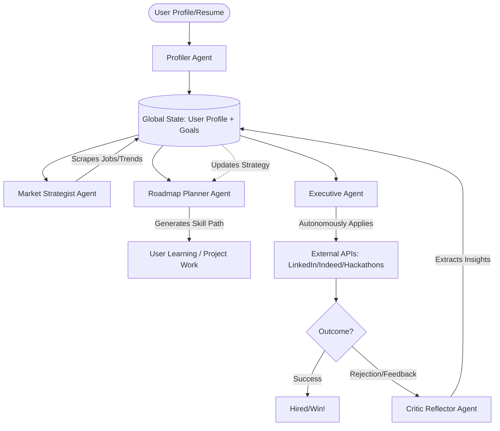

```mermaid
graph TD
    User([User Profile/Resume]) --> Profiler[Profiler Agent]
    Profiler --> State[(Global State: User Profile + Goals)]
    
    State --> Market[Market Strategist Agent]
    Market --> |Scrapes Jobs/Trends| State
    
    State --> Planner[Roadmap Planner Agent]
    Planner --> |Generates Skill Path| UserAction[User Learning / Project Work]
    
    State --> Exec[Executive Agent]
    Exec --> |Autonomously Applies| Opportunity[External APIs: LinkedIn/Indeed/Hackathons]
    
    Opportunity --> Outcome{Outcome?}
    Outcome --> |Success| Goal[Hired/Win!]
    Outcome --> |Rejection/Feedback| Critic[Critic Reflector Agent]
    
    Critic --> |Extracts Insights| State
    State -.-> |Updates Strategy| Planner
```
